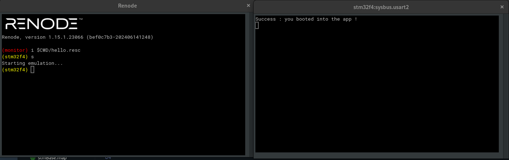

# Simplest Bootloader for STM32F4

This repository contains the simplest bootloader implementation for the STM32F4 microcontroller, designed to be used with the Renode simulation environment and Ceedling build system. The bootloader is responsible for initializing the hardware, checking for a valid application, and then jumping to the main application.

## Features

- **Minimal Hardware Initialization:** Sets up the system clock and basic GPIOs.
- **Application Jumping:** Loads and jumps to the main application located at a predefined memory address.
- **Error Handling:** Blinks an LED continuously if no valid application is found.

## Project Structure

```
simplest-bootloader
├── src
│   ├── main.c          # Bootloader source code
│   ├── startup_stm32f4xx.s  # Startup code for STM32F4
│   └── stm32f4xx.c     # STM32F4 HAL header file
|__ bootloader.elf # boot image
|__ app.elf # application image
├── hello.resc  # Renode script for simulating the STM32F4
├── README.md           # This file
└── ceedling_project.yml # Ceedling project configuration file
|__ Drivers # STM32F4 HAL drivers
```

## Getting Started

### Prerequisites

- **Ceedling:** Install Ceedling for building and testing the project.
- **Renode:** Install Renode for simulating the STM32F4 microcontroller.

### Building the Bootloader

1. Clone the repository:

   ```sh
   git clone https://github.com/yassinedevop/simplest-bootloader.git
   cd simplest-bootloader
   ```

2. Build the project using Ceedling:

   ```sh
   ceedling release
   ```

   This command compiles the bootloader and runs the unit tests.

### Running the Simulation

1. Open Renode and run the following command to load the simulation script:

   ```sh
   renode hello.resc
   ```

2. Start the simulation:

   ```sh
   start
   ```

   The bootloader will initialize, and if a valid application is present, it will jump to it.

### Testing the Bootloader
if everything is working correctly, you should see the following output:


## Customization

- **Memory Address:** You can change the memory address where the main application is located by modifying the `APP_ADDRESS` macro in `main.c`.
- **Error Handling:** Customize the LED blink pattern or add additional error handling in the `Bootloader_CheckApp` function.

## License

This project is licensed under the MIT License - see the [LICENSE](LICENSE) file for details.

## Acknowledgments

- [STM32F4 Reference Manual](https://www.st.com/resource/en/reference_manual/dm00031020.pdf)
- [Renode Documentation](https://renode.readthedocs.io/)
- [Ceedling Documentation](http://www.throwtheswitch.org/ceedling)

Happy coding!
